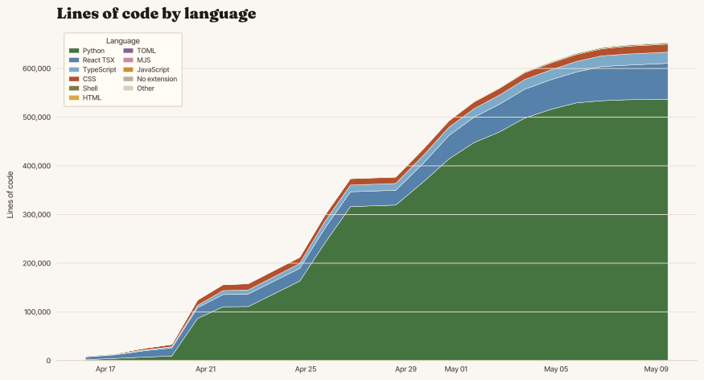

# crew.day

A self-hosted, agent-first system for managing household and short-term-rental
staff across one or more properties: maids, cooks, drivers, gardeners,
handymen, nannies, pool technicians, and the like.

Think **hotel operations for a household or small property team**: properties,
rooms, guests, staff roles, task schedules, standing instructions,
inventories, timesheets, payslips — all accessible to both humans (via a
mobile-first web app) and LLM agents (via a documented REST API and a thin CLI
that wraps it).

> **Status as of 2026-05-09:** active implementation. The original spec
> tree is still the source of truth, but the repo now contains the production
> FastAPI service, React SPA, CLI, migrations, tests, high-fidelity mocks, and
> a separate public-site deployable. It is not production-deployed yet; the
> shared dev app runs on loopback at `http://127.0.0.1:8100`.

## Why

Running a household with staff across multiple properties is operationally
the same problem as running a small hotel, but the tooling is fifteen years
behind. Existing hotel PMS software assumes a hotel's org chart, a front desk,
and a commercial chart of accounts. Household managers end up juggling
WhatsApp groups, paper checklists, and spreadsheets.

crew.day starts from a different premise: **the operator is an LLM agent**,
and the humans (owner, head of house, staff) interact through the surfaces
that are natural to them — a phone for the cleaner, an email digest for the
owner, a REST API for the agent.

## Core design choices

- **Agent-first.** Every feature is exposed over REST/OpenAPI before it is
  exposed in the UI. The CLI is a thin client over the REST API, so any
  agent can drive the whole system from any machine.
- **Passkeys only** for human login. No passwords. Managers bootstrap
  employees via emailed magic links that register a WebAuthn credential on
  the employee's phone.
- **Self-hosted or managed, workspace-scoped, multi-property.** The same
  codebase can run as a self-hosted household install or a managed SaaS
  deployment. Workspaces are the tenancy boundary; each workspace can manage
  one or more properties.
- **FastAPI + React SPA + SQLite/Postgres.** FastAPI on the server, a
  Vite + React + TypeScript strict SPA on the client (served by the
  same FastAPI process from `dist/`), with SQLite by default and
  Postgres for larger deployments. The mocks app is split as
  `mocks/app/` (JSON API + SPA fallback) and `mocks/web/` (SPA).
- **LLM-native.** Receipt OCR, natural-language task intake, daily digests,
  and a staff chat assistant all ship in v1. Default model is
  `google/gemma-4-31b-it` via OpenRouter, with a per-capability model
  assignment table so any model can be swapped in for any job.
- **PWA with offline support.** Staff open the site on their phone, add it
  to the home screen, and today's tasks remain tickable without connection.

## Current status

crew.day has moved well past the "specifications only" phase. The main
application now includes:

- A FastAPI backend under [`app/`](app/) with workspace-scoped APIs for auth,
  identity, properties, tasks, scheduling, stays, inventory, assets, payroll,
  expenses, billing, messaging, LLM routing, audit, admin, and health/runtime
  surfaces.
- A production React + Vite SPA under [`app/web/`](app/web/) with manager,
  worker, client, admin, public enrollment, passkey, settings, agent, and
  styleguide screens.
- The `crewday` CLI under [`cli/`](cli/) as a thin client/code-generated
  command surface over the OpenAPI-described API.
- Alembic migrations, SQLAlchemy models, SQLite/Postgres support, capability
  detection, audit/event plumbing, and deployment/admin commands.
- Automated coverage across unit, integration, contract, frontend, and
  Playwright end-to-end tests under [`tests/`](tests/) and `app/web/src/**/*.test.*`.
- A disposable dev/demo topology under [`mocks/`](mocks/) and an independently
  deployable marketing/suggestion-box surface under [`site/`](site/).

The remaining work is product hardening rather than blank-slate scaffolding:
open Beads tasks currently track frontend polish, empty-state gaps, asset
creation/document upload refinements, task-template creation, navigation edge
cases, and similar readiness issues. See [`SETUP.md`](SETUP.md) for the dev
stack and [`docs/specs/19-roadmap.md`](docs/specs/19-roadmap.md) for the
phase plan.

## How it's organized

The project is split across the production app, CLI, mocks, public site, and
specs. Start at [`docs/specs/00-overview.md`](docs/specs/00-overview.md) for
the product model and [`SETUP.md`](SETUP.md) for local development.

| # | Document | Purpose |
|---|----------|---------|
| 00 | [`overview.md`](docs/specs/00-overview.md) | Vision, personas, goals, non-goals |
| 01 | [`architecture.md`](docs/specs/01-architecture.md) | Stack, components, repo layout |
| 02 | [`domain-model.md`](docs/specs/02-domain-model.md) | Entities, ERD, ID strategy |
| 03 | [`auth-and-tokens.md`](docs/specs/03-auth-and-tokens.md) | Passkeys, magic links, API tokens |
| 04 | [`properties-and-stays.md`](docs/specs/04-properties-and-stays.md) | Properties, areas, iCal, guests |
| 05 | [`employees-and-roles.md`](docs/specs/05-employees-and-roles.md) | Staff model, roles, capabilities |
| 06 | [`tasks-and-scheduling.md`](docs/specs/06-tasks-and-scheduling.md) | Task model, RRULE, evidence |
| 07 | [`instructions-kb.md`](docs/specs/07-instructions-kb.md) | Global / house / room SOPs |
| 08 | [`inventory.md`](docs/specs/08-inventory.md) | Supplies, linens, reorder |
| 09 | [`time-payroll-expenses.md`](docs/specs/09-time-payroll-expenses.md) | Clock-in, pay rules, expense claims |
| 10 | [`messaging-notifications.md`](docs/specs/10-messaging-notifications.md) | Comments, issues, email, webhooks |
| 11 | [`llm-and-agents.md`](docs/specs/11-llm-and-agents.md) | OpenRouter, model assignment, audit |
| 12 | [`rest-api.md`](docs/specs/12-rest-api.md) | OpenAPI surface, conventions |
| 13 | [`cli.md`](docs/specs/13-cli.md) | `crewday` CLI for agents |
| 14 | [`web-frontend.md`](docs/specs/14-web-frontend.md) | React SPA, PWA, offline, a11y |
| 15 | [`security-privacy.md`](docs/specs/15-security-privacy.md) | Threat model, secrets, GDPR |
| 16 | [`deployment-operations.md`](docs/specs/16-deployment-operations.md) | Packaging, backups, observability |
| 17 | [`testing-quality.md`](docs/specs/17-testing-quality.md) | Test strategy, CI gates |
| 18 | [`i18n.md`](docs/specs/18-i18n.md) | Deferred locales, seam design |
| 19 | [`roadmap.md`](docs/specs/19-roadmap.md) | Phased delivery plan |
| 20 | [`glossary.md`](docs/specs/20-glossary.md) | Terms used across the spec |
| 21 | [`assets.md`](docs/specs/21-assets.md) | Asset catalog, documents, QR, maintenance |
| 22 | [`clients-and-vendors.md`](docs/specs/22-clients-and-vendors.md) | Agency/client/vendor workflows |
| 23 | [`chat-gateway.md`](docs/specs/23-chat-gateway.md) | Chat gateway adapter seam |
| 24 | [`demo-mode.md`](docs/specs/24-demo-mode.md) | Demo deployment behavior and guardrails |
| 25 | [`marketplace.md`](docs/specs/25-marketplace.md) | Deferred marketplace design reservation |

For agent-development conventions (how to work on this codebase), see
[`AGENTS.md`](AGENTS.md).

## Non-goals

Explicitly **not** in scope for v1 (see `docs/specs/00-overview.md` for the
full list and rationale):

- Paid plans, metered billing, payment collection, or tax handling
- Tax calculation, statutory filings, or legal HR compliance
- Guest booking / payment acceptance (we import reservations; we do not sell them)
- Integrated accounting (QuickBooks, Xero) — CSV export only
- Native mobile apps
- Real-time human-to-human chat (use task comments, email, and agent chat)

## Lines of Code over Time

_Updated via `scripts/update-loc-chart.sh`._

## License

Functional Source License 1.1 (ALv2 Future License) — see [`LICENSE.md`](LICENSE.md).
