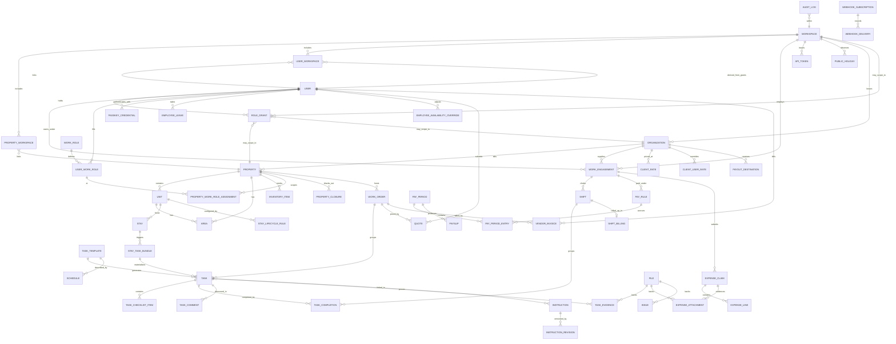

# 02 — Domain model

## Conventions

### Identifiers

- Every row uses a **ULID** primary key rendered as Crockford base32
  (26 chars, e.g. `01HXZ3...`). Stored as `CHAR(26)` in SQLite and
  `TEXT` / `uuid`-compatible in Postgres, never as an integer.
- ULIDs are **k-sortable** so we avoid adding a separate `created_at`
  index for time-range queries.
- Public URLs use ULIDs as-is; no separate slug table. Human-friendly
  references (e.g. `maid-maria`) are optional `handle` columns where
  useful, constrained unique per parent scope.

### Timestamps

- `created_at`, `updated_at` on every row. UTC.
- Business times (shift start/end, task due, stay check-in) that are
  logically local to a property carry a separate `timezone` column
  **on the parent property** — never on each row.
- `deleted_at` (nullable) implements **soft delete** on user-facing
  entities. Historical rows reference soft-deleted parents by ID;
  the UI hides them, the audit log never does.

### Soft delete policy

- All user-editable entities (Property, Unit, Employee, Role, Task,
  TaskTemplate, Instruction, InventoryItem, Stay) are **soft-deletable**.
- Children with a soft-deleted parent are **hidden** but their rows
  remain, so timesheets and audit log stay whole.
- Foreign keys between soft-deletable entities use
  `ON DELETE RESTRICT` at the DB level and a domain-level cascade that
  only ever soft-deletes. See skill `/new-fk-relationship`.
- `PUT /.../{id}/restore` (manager scope) reverses a soft delete.
- Hard delete is **admin-only** and available through a single dedicated
  CLI command (`miployees admin purge`) with a mandatory confirmation;
  it runs a trigger-based integrity check first.

### Naming

- Table names are **plural snake_case** (`tasks`, `task_templates`).
- Join tables `parents_children` (`users_work_roles`).
- Enums are TEXT with a CHECK constraint in SQLite, native in Postgres.

### Tenancy seam

Every user-editable row carries `workspace_id CHAR(26) NOT NULL`.
(v0 called this column `household_id`; see the "Migration" note at
the bottom of this document.)

**Uniqueness constraints are scoped to `workspace_id` from day one.**
Any `UNIQUE` on a user-editable column is a composite unique on
`(workspace_id, <col>)`. Examples: `role.key`, `instruction.slug`,
`property.name`, `inventory_item.sku`. System-seeded catalog values
(capability keys, webhook event types) are globally unique because
they are not user-editable.

v1 ships with a single workspace row seeded at first boot; multi-
tenancy is then purely a matter of allowing more rows and adding RLS
in Postgres (§15). No code change elsewhere.

### Villa belongs to many workspaces

A `property` (informally "villa") is **not** owned by a single
workspace. The same physical place can appear in more than one
workspace simultaneously — for example a rental manager's workspace
and the owning family's workspace both see the same house. The link
is carried by the junction table `property_workspace` below. Every
property still has a "home" workspace (the one that created it),
but authorisation is expressed against the junction plus the
identity model below, not against the home workspace alone.

### Unified identity

v1 replaces the v0 split between `manager` and `employee` with a
single `users` table and a **role-grant** permission model. One
person = one `users` row (one login identity, one passkey set, one
email), regardless of whether they are the head of a household, a
maid, a driver, a billing client, or all four at once on different
scopes. Their authority in any given scope is expressed by one or
more `role_grants` rows — see "Shared tables → `users`" and
"Shared tables → `role_grants`" below, plus §03 (auth) and §05
(work roles and capabilities).

This collapses three things that used to be separate:

- v0 `manager` rows (logins with workspace-wide authority).
- v0 `employee` rows (logins with task-scoped authority).
- `organization.portal_user_id` (reserved future seam for a client
  to log in; now subsumed by a `role_grants` row with
  `scope_kind = 'organization'` or with `grant_role = 'client'` on
  a workspace / property).

The term "employee" is retained only as a **domain term** for a
person who performs work under a `work_engagement` (§22) — it is
no longer an entity in the schema. New code and new specs refer to
`users` and their `role_grants`.

### User belongs to many workspaces

A user may be active in multiple workspaces at once: a `role_grants`
row on a workspace, on one of that workspace's properties, or on an
organization linked to it. Rather than derive workspace membership
at query time, the schema stores it explicitly in `user_workspace`
(materialized junction, see below) so RLS filters (§15) and
"list users of this workspace" queries stay fast and auditable.

## Entity catalog

Diagram in Mermaid (viewers without Mermaid support can read the
prose list below).



Entities in the diagram but not detailed inline here have their
columns defined in the section referenced in the catalog below.
`task_assignment` is not an entity — task assignment is captured as
`task.assigned_user_id` (see §06). `capability_flag` is not an
entity either — capabilities are sparse JSON blobs on `work_role`
and `user_work_role` (see §05), and `role_grants.capability_override`
shadows them for scope-wide overrides.

### Core entities (by document)

- **Auth / identity** (§03): `user`, `role_grant`, `passkey_credential`,
  `magic_link`, `break_glass_code`, `api_token`, `session`.
- **Places** (§04): `property`, `unit`, `area`, `stay`, `guest_link`,
  `ical_feed`.
- **People, work roles, engagements** (§05, §22): `work_role`,
  `user_work_role`, `property_work_role_assignment`,
  `work_engagement`.
- **Work** (§06): `task_template`, `schedule`, `task`,
  `task_checklist_item`, `task_completion`, `task_evidence`,
  `task_comment`, `stay_lifecycle_rule`, `stay_task_bundle`,
  `employee_leave`, `employee_availability_override`,
  `public_holiday`, `property_closure`. (`employee_*` table names
  are retained for historical continuity; they now store rows
  keyed by `user_id` rather than a separate `employee_id`.)
- **Instructions / SOPs** (§07): `instruction`, `instruction_revision`,
  `instruction_link`.
- **Inventory** (§08): `inventory_item`, `inventory_movement`.
- **Time / pay / expenses** (§09): `shift`, `pay_rule`, `pay_period`,
  `pay_period_entry`, `payslip`, `payout_destination`, `expense_claim`,
  `expense_line`, `expense_attachment`. All pay-pipeline rows
  reference `work_engagement_id` (not `user_id` directly), so the
  same person on different workspaces bills/accrues independently.
- **Clients, vendors, work orders** (§22): `organization`,
  `client_rate`, `client_user_rate`, `shift_billing`,
  `work_order`, `quote`, `vendor_invoice`. `payout_destination` is
  shared with §09; destinations may be owned by a user **or**
  an organization.
- **Comms** (§10): `digest_run`, `email_delivery`, `email_opt_out`,
  `webhook_subscription`, `webhook_delivery`, `issue`.
- **Assets** (§21): `asset_type`, `asset`, `asset_action`,
  `asset_document`.
- **LLM** (§11): `model_assignment`, `llm_call`, `agent_action`,
  `anomaly_suppression`.
- **Files** (§02 "Shared tables", storage backend in §15): `file` —
  shared blob-reference table used by `task_evidence`,
  `expense_attachment`, `issue.attachment_file_ids`,
  `instruction_revision.attachment_file_ids`, and
  `user.avatar_file_id`.
- **Cross-cutting** (§15): `audit_log`, `secret_envelope`.

All human mutations emit `user.*` events. Non-human actors (scoped
agents, the worker) emit `agent.*` / `system.*` events. There is no
`manager.*` or `employee.*` event family.

Each subsequent document defines its entities' columns, invariants, and
state machines in detail. This file holds only the shared rules.

## Shared tables

### `workspaces`

(v0 name: `households`. The rename happens in the same migration that
introduces `workspace_id` on every user-editable table.)

| column        | type        | notes                              |
|---------------|-------------|------------------------------------|
| id            | ULID PK     | seeded at first boot               |
| name          | text        | displayed in UI                    |
| default_language | text     | BCP-47; used by §10 auto-translation and digest prose |
| default_currency | text    | ISO-4217. Referenced by Money section below; per-property override in §04. |
| default_country | text     | ISO-3166-1 alpha-2. Workspace-level fallback for properties. |
| default_locale | text?     | BCP-47 locale tag (e.g. `fr-FR`). Nullable; when null, derived from `default_language` + `default_country`. Drives number/date/currency formatting on workspace-scoped documents. |
| created_at    | tstz        |                                    |
| settings_json | jsonb/text  | flat map of `dotted.key → value`; holds concrete workspace defaults for every registered setting (see "Settings cascade" below) |

### `property_workspace`

Junction table. A property can belong to more than one workspace.
One row per `(property_id, workspace_id)` pair.

| column             | type    | notes                                                    |
|--------------------|---------|----------------------------------------------------------|
| property_id        | ULID FK | references `property.id`                                 |
| workspace_id       | ULID FK | references `workspace.id`                                |
| membership_role    | text    | `owner_workspace \| managed_workspace \| observer_workspace` (see below) |
| added_at           | tstz    |                                                          |
| added_by_user_id   | ULID?   | nullable for system seeds; references `users.id`         |
| added_via          | text    | `user \| agent \| system`                                |

Primary key `(property_id, workspace_id)`. On soft-delete of a
property the junction rows remain (history is preserved); on
workspace delete the rows are hard-dropped.

**`membership_role`** expresses how the workspace relates to the
property, not a user permission:

- **`owner_workspace`** — the workspace where the property was
  created, or which a human owner later transferred control to.
  Exactly one per property. Users with `role_grants` on this
  workspace may grant/revoke access to other workspaces. Also the
  RLS "home" for orphan-property checks (§15).
- **`managed_workspace`** — another workspace granted operational
  access by the owner workspace (e.g. an agency managing a client's
  villa). Tasks, shifts, and work_orders created under this
  workspace are tagged with its `workspace_id`.
- **`observer_workspace`** — read-only access. Rare; useful when a
  consulting party needs visibility without write rights.

### `user_workspace`

Junction table. A user is materialised in every workspace where
they hold at least one `role_grants` row (directly or transitively
via a property). Membership is derived, but stored, so uniqueness
constraints, RLS filters (§15), and "list users of this workspace"
queries stay fast and auditable.

| column        | type    | notes                                                       |
|---------------|---------|-------------------------------------------------------------|
| user_id       | ULID FK |                                                             |
| workspace_id  | ULID FK |                                                             |
| source        | text    | `workspace_grant \| property_grant \| org_grant \| work_engagement` |
| added_at      | tstz    |                                                             |

Primary key `(user_id, workspace_id)`. A worker job refreshes the
rows whenever an upstream `role_grants`, `work_engagement`, or
`property_workspace` row changes, in the same transaction. Rows
persist until every upstream source is revoked.

### `users`

One row per human login identity. Every person with a passkey has
exactly one `users` row, regardless of how many workspaces,
properties, or organizations they are connected to.

| column              | type      | notes                                                             |
|---------------------|-----------|-------------------------------------------------------------------|
| id                  | ULID PK   |                                                                   |
| primary_workspace_id | ULID FK? | nullable; the workspace the user was first invited into. UI sort key only — authorisation never consults this column. |
| display_name        | text      | shown to everyone who can see them                                |
| full_legal_name     | text?     | visible only on scopes where the viewer has `manager` or `owner` grant; redacted from `worker` and `client` views |
| email               | text      | globally unique across the deployment; used for magic links and digest emails |
| phone_e164          | text?     | manager/owner-visible only                                        |
| avatar_file_id      | ULID FK?  | `file.id`                                                         |
| timezone            | text      | user's default; property/workspace context may override for display |
| languages           | text[]    | BCP-47 spoken; informational                                      |
| preferred_locale    | text?     | BCP-47 locale tag; formatting override (§18)                      |
| emergency_contact   | jsonb     | `{name, phone_e164, relation}`; manager/owner-visible only        |
| notes_md            | text      | visible to `manager`/`owner` grants on any scope the user is on   |
| archived_at         | tstz?     | global archive — revokes all passkeys and sessions deployment-wide |
| created_at          | tstz      |                                                                   |
| updated_at          | tstz      |                                                                   |

**Uniqueness.** `email` is globally unique and case-insensitive.
Emails are the identity handle for magic-link enrollment; a single
mailbox maps to exactly one `users` row. Re-using an email that
already has a user attaches the invite to the existing row (see §03).

**Archiving a user** is distinct from archiving a work engagement.
Setting `users.archived_at` revokes all passkeys and sessions
immediately (§03). Existing `role_grants` rows persist for audit
and are resolved as inactive. A user cannot be archived while they
hold an `owner` grant on any workspace, property, or organization
where they are the sole owner — the owner role must be transferred
first, otherwise the archive attempt returns 409 with
`error = "would_orphan_owner_scope"`.

**`languages` vs `preferred_locale`.** `languages` is what they
speak (informational). `preferred_locale` drives number/date/currency
formatting on user-facing documents (payslips, digests). When
`preferred_locale` is null, resolution falls back to
`languages[0]` combined with the primary property's country, then
workspace `default_locale`, then `en-US`.

### `role_grants`

The permission model. One row per `(user, scope_kind, scope_id,
grant_role)`; a user may hold several grants on the same scope
(e.g. owner of workspace W plus worker of workspace W, as long as
the `grant_role`s differ).

| column             | type      | notes                                                                 |
|--------------------|-----------|-----------------------------------------------------------------------|
| id                 | ULID PK   |                                                                       |
| user_id            | ULID FK   |                                                                       |
| scope_kind         | text      | `workspace \| property \| organization`                               |
| scope_id           | ULID      | references `workspace.id` / `property.id` / `organization.id`         |
| grant_role         | text      | `owner \| manager \| worker \| client \| guest`                       |
| binding_org_id     | ULID FK?  | only meaningful when `scope_kind = 'workspace'` and `grant_role = 'client'`; narrows the client's visibility to data billed to this organization within the workspace |
| capability_override | jsonb    | sparse merge on top of the grant_role's catalog defaults              |
| started_on         | date      | when the grant takes effect                                           |
| ended_on           | date?     | when it expired (null = active)                                       |
| granted_by_user_id | ULID FK?  | audit; null for the self-grant emitted at workspace creation          |
| granted_at         | tstz      |                                                                       |
| revoked_at         | tstz?     | set when the grant is revoked (soft-retire); an ended_on in the past without a revoke is treated as "grant lapsed"  |
| revoked_by_user_id | ULID FK?  |                                                                       |
| revoke_reason      | text?     |                                                                       |

Primary key `(user_id, scope_kind, scope_id, grant_role)` with
`revoked_at IS NULL` (partial index; revoked rows are kept for
audit and a user may be re-granted the same role later).

**Valid `grant_role` per `scope_kind`:**

| scope_kind     | owner | manager | worker | client | guest |
|----------------|:-----:|:-------:|:------:|:------:|:-----:|
| `workspace`    | ✅    | ✅      | ✅     | ✅     | ✅*   |
| `property`     | ✅    | ✅      | ✅     | ✅     | ✅*   |
| `organization` | ✅    | ✅      | —      | —      | —     |

\* `guest` is reserved for future use — v1 guests still enter
through the tokenized `guest_link` (§04), not through `role_grants`.
Rows with `grant_role = 'guest'` are allowed in the schema but
have no UI surface in v1. See §19.

**Semantics.**

- **`owner`** — full authority in the scope, including the right
  to grant/revoke every other role. Exactly one `owner` grant per
  scope, enforced by a partial unique index on
  `(scope_kind, scope_id, grant_role)` where
  `grant_role = 'owner' AND revoked_at IS NULL`. Transfer requires
  the outgoing owner's approval or an admin action (§15).
- **`manager`** — full authority except cannot demote, archive, or
  transfer the owner. Multiple managers allowed.
- **`worker`** — operational access. A workspace-level worker grant
  requires at least one `user_work_role` row in the same workspace
  (validated at write time); the worker surface is further narrowed
  by `property_work_role_assignment` rows (§05). A property-level
  worker grant may exist without a workspace-level one — that models
  a worker who only operates at one specific shared property.
- **`client`** — read access to data they are billed for, plus the
  ability to accept/reject quotes and invoices tied to them (money-
  routing actions remain unconditionally approval-gated, §11).
  Workspace-scope client grants with `binding_org_id` see
  everything in the workspace tagged to that org; property-scope
  client grants see that property only.
- **`guest`** — reserved; see above.

**Resolution order for property access** — given a `(user, property)`
pair:

1. A `role_grants` row with `scope_kind = 'property'` and
   `scope_id = property.id` — use its `grant_role`.
2. Otherwise, for each workspace in the property's
   `property_workspace` junction, look for a `role_grants` row
   with `scope_kind = 'workspace'` and `scope_id = <that workspace>`.
   If multiple workspaces match, use the highest-privilege
   `grant_role` across them (`owner > manager > worker > client > guest`).
3. Otherwise, no access.

**Resolution order for workspace access** — given a `(user, workspace)`
pair, use the `role_grants` row with `scope_kind = 'workspace'`
directly, or any property-level grant on a property in that
workspace (narrower — user sees only the tasks/shifts of that
property, not the workspace at large).

**Capability cascade** for grant-scoped capabilities:

1. `role_grants.capability_override` (most specific)
2. Catalog defaults for the effective `grant_role`
3. Compile-time catalog default (see §05)

Where a capability is relevant to **work** rather than **grant**
(e.g. `time.clock_in`, `tasks.photo_evidence`), the resolution
chain from §05 applies (`user_work_role` / `property_work_role_assignment`
/ `work_role.default_capabilities`). The grant cascade above
controls UI-access capabilities (`managers.invite`,
`organizations.edit_pay_destination`, `clients.accept_quote`, etc.).

**Catalog of grant-scoped capabilities.** See §05 for the
work-scoped catalog; the grant-scoped catalog is:

| key                                | owner | manager | worker | client | guest |
|------------------------------------|:-----:|:-------:|:------:|:------:|:-----:|
| `scope.view`                       | ✅    | ✅      | ✅     | ✅     | ✅    |
| `users.invite`                     | ✅    | ✅      | —      | —      | —     |
| `users.revoke_grant`               | ✅    | ✅*     | —      | —      | —     |
| `users.archive`                    | ✅    | ✅*     | —      | —      | —     |
| `scope.edit_settings`              | ✅    | ✅      | —      | —      | —     |
| `scope.transfer_owner`             | ✅    | —       | —      | —      | —     |
| `properties.create`                | ✅    | ✅      | —      | —      | —     |
| `properties.archive`               | ✅    | ✅      | —      | —      | —     |
| `workspaces.archive`               | ✅    | —       | —      | —      | —     |
| `organizations.edit_pay_destination` | ✅  | ✅      | —      | —      | —     |
| `work_orders.view`                 | ✅    | ✅      | ✅†    | ✅‡    | —     |
| `quotes.accept`                    | ✅    | ✅      | —      | ✅§    | —     |
| `vendor_invoices.approve`          | ✅    | ✅      | —      | —      | —     |

\* Managers cannot revoke grants or archive users whose sole
remaining grant in that scope is `owner`.
† Workers see work_orders they are assigned to.
‡ Clients see work_orders billed to them.
§ `client.quotes.accept` is subject to §11 approval gating.

**Revocation.** Revoking a grant writes `revoked_at` and clears
the row's effective state without deleting it (audit trail).
Re-granting the same `(user, scope_kind, scope_id, grant_role)`
triple inserts a new row with a new `id`; the old row stays for
history.

### `work_engagement`

Per-(user, workspace) employment relationship. Carries the pay
pipeline that used to sit on `employee` in v0. A user who holds a
`worker` grant on a workspace and draws compensation for it has
exactly one active `work_engagement` row in that workspace.
A user may have several over time (archived + new) and multiple
active rows across different workspaces.

| column                         | type      | notes                                                             |
|--------------------------------|-----------|-------------------------------------------------------------------|
| id                             | ULID PK   |                                                                   |
| user_id                        | ULID FK   |                                                                   |
| workspace_id                   | ULID FK   |                                                                   |
| engagement_kind                | text      | `payroll \| contractor \| agency_supplied` (see §22)              |
| supplier_org_id                | ULID FK?  | required iff `engagement_kind = 'agency_supplied'`, else null     |
| pay_destination_id             | ULID FK?  | default payout for payslips / vendor invoices to this engagement (§09) |
| reimbursement_destination_id   | ULID FK?  | default for expense reimbursements; null → falls back to `pay_destination_id` |
| started_on                     | date      | engagement start                                                  |
| archived_on                    | date?     | engagement end; archives the pay pipeline, not the user           |
| notes_md                       | text      | manager-visible                                                   |
| created_at / updated_at        | tstz      |                                                                   |

Partial unique: `(user_id, workspace_id)` where `archived_on IS NULL`
— at most one active engagement per (user, workspace). Switching
`engagement_kind` follows the gating rules in §22.

The pay-pipeline rows in §09 (`pay_rule`, `payslip`, `shift`,
`expense_claim`) reference `work_engagement_id`; they never
reference `user_id` directly, so the same person in different
workspaces accrues and bills independently.

### `audit_log`

Append-only. Written in the same transaction as every mutation.

| column             | type    | notes                                 |
|--------------------|---------|---------------------------------------|
| id                 | ULID PK |                                       |
| workspace_id       | ULID FK |                                       |
| correlation_id     | ULID    | request-level by default; groups multi-row edits |
| occurred_at        | tstz    |                                       |
| actor_kind         | text    | `user`, `agent`, `system`. Every human action — whether the user holds an `owner`, `manager`, `worker`, or `client` grant — is logged as `user`; the grant under which the action was taken is captured in `actor_grant_role` below. `agent` is used only for standalone scoped-token callers (delegated-token requests log as `user`). |
| actor_id           | ULID    | references `users.id` for `actor_kind = 'user'`; nullable only for `system` |
| actor_grant_role   | text?   | `owner | manager | worker | client`; the grant_role under which the action was authorised. Null when the action is identity-scoped rather than scope-scoped (e.g. a user editing their own profile). |
| via                | text    | `web`, `api`, `cli`, `worker`         |
| token_id           | ULID    | nullable; populated for `api`/`cli`   |
| action             | text    | `task.create`, `task.complete`, etc.  |
| entity_kind        | text    | `task`, `user`, `role_grant`, `work_engagement`, ... |
| entity_id          | ULID    |                                       |
| before_json        | jsonb   | nullable (create)                     |
| after_json         | jsonb   | nullable (delete)                     |
| reason             | text    | optional, agent-supplied              |
| agent_label        | text?   | token `name`; set when action performed via a delegated token (§03) |
| agent_conversation_ref | text? | opaque prompt/conversation ref from `X-Agent-Conversation-Ref`, up to 500 chars |

**Correlation scope.** `correlation_id` defaults to the HTTP request
ID (generated server-side if the caller did not pass
`X-Correlation-Id`). A caller that wants to group multiple HTTP
requests into one logical workflow may pass the same
`X-Correlation-Id` on each; the server does not validate grouping
semantics. `audit_log` rows emitted by a single transaction always
share the same `correlation_id`.

Retention: default 2 years; configurable per workspace. Worker job
`rotate_audit_log` moves rows older than retention into
`audit_log_archive.jsonl.gz` under `$DATA_DIR/archive/`.

### `file`

Shared blob reference row. The backend storage driver is pluggable
(local disk in v1, S3/GCS post-v1); the row is the durable identifier.

| column           | type    | notes                                  |
|------------------|---------|----------------------------------------|
| id               | ULID PK |                                        |
| workspace_id     | ULID FK |                                        |
| sha256           | text    | content hash; unique per workspace     |
| byte_size        | int     |                                        |
| mime_type        | text    | server-sniffed (§15)                   |
| original_name    | text    | user-supplied; never trusted for paths |
| storage_driver   | text    | `local` (v1) \| `s3` (post-v1)         |
| storage_key      | text    | driver-specific locator                |
| uploaded_by_kind | text    | `user` \| `agent`                      |
| uploaded_by_id   | ULID    | `users.id` when `uploaded_by_kind = 'user'` |
| created_at       | tstz    |                                        |
| deleted_at       | tstz?   |                                        |

Local driver writes to `$DATA_DIR/files/{workspace_id}/{sha256[0:2]}/
{sha256[2:4]}/{sha256}`. See §15 for MIME sniffing, EXIF stripping, and PDF script
rejection.

### `secret_envelope`

Per-workspace AES-GCM-encrypted blobs for secret values we must store
(OpenRouter API key, SMTP password, iCal feed URLs that carry tokens).
See §15.

## Schema evolution rules

- Every change ships as an **Alembic migration** in `migrations/`, with
  a short doc comment explaining intent.
- Additive migrations (new column nullable, new table, new enum value)
  deploy without downtime.
- Destructive migrations (drop column, narrow type) are a **two-release
  dance**: release N deprecates the column and stops reading it,
  release N+1 drops it.
- Every migration includes a downgrade unless it is lossy; lossy
  migrations say so explicitly and fail downgrade with a clear message.
- Backfills >1M rows run in the **worker**, not inline in the migration.
- See `/new-migration` skill for the complete checklist (column types,
  indexes, backfill, downgrade, idempotency).

## Portability (SQLite ↔ Postgres)

- Use only SQLAlchemy 2.x core expressions. No raw dialect SQL outside
  `app/adapters/db/`.
- JSON fields: SQLAlchemy `JSON` type maps to `jsonb` on Postgres and
  `TEXT` on SQLite. Queries against JSON fields live behind helper
  functions in `adapters/db/`.
- Full-text search:
    - SQLite: FTS5 virtual tables built from triggers.
    - Postgres: `GIN (tsvector)`.
    - Single query interface `search.search_tasks(q, scope)` picks the
      right backend.
- Transactions must hold for single logical operations and must not
  hold across LLM calls (see §11).

## Derived fields

Derived fields are computed and persisted **only** when recomputing on
read is too expensive:

- `task.scheduled_for_local` — stored alongside UTC for fast day-view
  queries.
- `shift.duration_seconds` — populated on clock-out.
- `expense_claim.total_amount_cents` — recomputed on line add/remove.
- `inventory_item.on_hand` — recomputed on every movement, in the same
  transaction.
- `asset_action.last_performed_at` — updated when a task with
  `asset_action_id` is completed (§21).
- `shift_billing.subtotal_cents` — recomputed when the parent
  shift's time fields change (§22).
- `work_order.state` — transitions driven by child quote/invoice
  state changes (`quoted`/`invoiced`/`paid` derive from child
  rows; see §22 "State machine").

A `--recompute` CLI command recomputes all derived fields; a periodic
CI job asserts no drift in test fixtures.

## Settings cascade

Many configuration values need to vary by entity level. Rather than
ad-hoc resolution logic per feature, the codebase uses a **single
unified cascade** that applies to all entity-level settings.

### Key naming

Canonical keys use **dotted namespaces**: `evidence.policy`,
`time.clock_mode`, `time.geofence_radius_m`. This matches the
existing capability key convention in §05.

### Resolution order

The cascade has five layers, from broadest to most specific:

1. **Workspace** — `workspaces.settings_json`. Always concrete
   (never `inherit`); this is the catalog default merged with
   manager overrides.
2. **Property** — `properties.settings_override_json`.
3. **Unit** — `units.settings_override_json`.
4. **Work engagement** — `work_engagements.settings_override_json`.
   Scoped per (user, workspace); settings here apply to every
   task/shift the user performs under that engagement. Replaces
   what v0 called the "employee layer".
5. **Task** — `tasks.settings_override_json`.

**Most specific wins.** Resolution walks from the task inward:
task → work_engagement → unit → property → workspace, stopping at
the first concrete (non-`inherit`) value. An absent key means
"inherit". An explicit `null` value means "inherit" (delete
override at this layer). Non-root layers default to `inherit`, so
the common case is "follow the workspace default unless a
property, a unit, a specific engagement, or a specific task
deliberately narrows or widens the rule." Single-unit properties
see no behavioral change (the unit inherits everything from the
property). A user who holds no `work_engagement` in the workspace
(pure `client` grant, for example) skips layer 4 entirely.

### Schema

Each entity gets a sparse `settings_override_json JSONB` column
(nullable, default `{}`). The unit layer uses the same column name
on `units`. Workspace defaults live in `workspaces.settings_json` —
a flat map of `dotted.key → value` holding concrete workspace
defaults for every registered setting.

### Override scope

Each key declares which layers may override it (e.g.
`evidence.policy` = W/P/U/E/T; `pay.frequency` = W only). The code
allows all five layers; scope is a UI/validation concern that
prevents surprising overrides from reaching the resolver.

### Catalog

All registered setting keys, their type, catalog default, override
scope, and the spec that defines the feature:

| key | type | default | scope | spec |
|-----|------|---------|-------|------|
| `evidence.policy` | enum | `optional` | W/P/U/WE/T | §05, §06 |
| `time.clock_mode` | enum | `manual` | W/P/U/WE | §09 |
| `time.auto_clock_idle_minutes` | int | `30` | W/P/U/WE | §05 |
| `time.geofence_radius_m` | int | `150` | W/P/U | §09 |
| `time.geofence_required` | bool | `false` | W/P/U/WE | §05 |
| `pay.frequency` | enum | `monthly` | W | §09 |
| `pay.week_start` | enum | `monday` | W | — |
| `retention.audit_days` | int | `730` | W | §02 |
| `retention.llm_calls_days` | int | `90` | W | §02, §11 |
| `retention.task_photos_days` | int | `365` | W | — |
| `scheduling.horizon_days` | int | `30` | W/P | §06 |
| `tasks.checklist_required` | bool | `false` | W/P/U/WE/T | §05 |
| `tasks.allow_skip_with_reason` | bool | `true` | W/P/U/WE | §05 |
| `assets.warranty_alert_days` | int | `30` | W/P | §21 |
| `assets.show_guest_assets` | bool | `false` | W/P/U | §21 |

"WE" in the scope column refers to the **work_engagement** layer
(per-(user, workspace) row), replacing the v0 "employee" scope tag.

### Relationship to capabilities

Capabilities (§05) remain a parallel system for per-(user_work_role,
work_role, property) feature toggles — they gate UI affordances and
scheduling behaviour. `role_grants.capability_override` (see
`role_grants` above) is the third parallel system, scoping
identity/authority capabilities per grant. The settings cascade
handles **entity-level configuration**: values that shape how a
feature works rather than whether it is available.

Where keys overlap (e.g. `time.clock_mode` appears in both the
capability catalog and the settings catalog), the settings cascade
takes precedence. Full resolution for overlapping keys:
task → work_engagement → unit → property → (capability chain) →
workspace → catalog default.

### Resolved settings function

```
resolve_setting(key, workspace_id, property_id?, unit_id?, work_engagement_id?, task_id?)
  → {value, source_layer, source_entity_id}
```

The function walks the cascade and returns both the effective value
and provenance (which layer provided it and the entity id at that
layer). The API exposes this as `GET /settings/resolved` (§12).

## Money

- All money stored as **integer cents** plus ISO-4217 `currency` (text)
  on the owning row. No floats.
- `default_currency` is a column on `workspaces` (see table above).
  Per-property override via `property.default_currency` (§04).
- **Currency minor units** are looked up from a static ISO-4217 table
  (JPY=0, BHD=3, EUR=2). All `*_cents` columns store the currency's
  minor unit. Formatting uses the minor-unit count, never hardcoded
  `/ 100`.
- v1 enforces that all pay rules for a single `work_engagement`
  within one pay period share one currency.
- Lifting the single-currency-per-period constraint later requires only
  conversion logic at period-close time -- the per-entity `currency`
  columns are already in place.
- Expenses may be in any currency, converted to the workspace default at
  approval time using the snapshot rate stored on the expense line.

### Country and locale

**Country and locale follow the same inheritance pattern as timezone:**
workspace default -> property override -> (for locale) user override
on `users.preferred_locale`.
Absent means "inherit"; present means "use this value, stop inheritance."

Resolution chains for locale are documented in §18.

## Enums (canonical list)

Defined once per document where the enum lives; summarized here.

- `actor_kind`: `user | agent | system` (`agent` for standalone scoped-token callers only; delegated tokens log as `user` — see §03)
- `scope_kind`: `workspace | property | organization`
- `grant_role`: `owner | manager | worker | client | guest`
- `property_workspace.membership_role`: `owner_workspace | managed_workspace | observer_workspace`
- `user_workspace.source`: `workspace_grant | property_grant | org_grant | work_engagement`
- `task_state`: `scheduled | pending | in_progress | completed | skipped | cancelled | overdue`
- `stay_status`: `tentative | confirmed | in_house | checked_out | cancelled`
- `stay_source`: `manual | airbnb | vrbo | booking | google_calendar | ical`
- `pay_rule_kind`: `hourly | monthly_salary | per_task | piecework`
- `pay_period_status`: `open | locked | paid`
- `payslip_status`: `draft | issued | paid | voided`
- `shift_status`: `open | closed | disputed`
- `expense_state`: `draft | submitted | approved | rejected | reimbursed`
- `expense_line_source`: `ocr | manual` (see §09 for interaction with `edited_by_user`)
- `asset_condition`: `new | good | fair | poor | needs_replacement`
- `asset_status`: `active | in_repair | decommissioned | disposed`
- `asset_document_kind`: `manual | warranty | invoice | receipt | photo | certificate | contract | permit | insurance | other`
- `asset_type_category`: `climate | appliance | plumbing | pool | heating | outdoor | safety | security | vehicle | other`
- `inventory_movement_reason`: `restock | consume | adjust | waste | transfer_in | transfer_out | audit_correction`
- `delivery_state`: `queued | sent | delivered | bounced | failed`
- `property_kind`: `residence | vacation | str | mixed` (semantics in §04)
- `lifecycle_trigger`: `before_checkin | after_checkout | during_stay`
- `stay_bundle_state`: `scheduled | in_progress | completed | cancelled`
- `scheduling_effect`: `block | allow | reduced`
- `holiday_recurrence`: `annual` (nullable enum — null = one-off)
- `leave_category`: `vacation | sick | personal | bereavement | other`
- `issue_status`: `open | in_progress | resolved | wont_fix`
- `capability`: see §05.
- `engagement_kind`: `payroll | contractor | agency_supplied` (§05, §22)
- `organization_role`: bitmap on `organization` (`is_client`, `is_supplier`); at least one must be true (§22)
- `work_order_state`: `draft | quoted | accepted | in_progress | completed | cancelled | invoiced | paid` (§22)
- `quote_status`: `draft | submitted | accepted | rejected | superseded | expired` (§22)
- `vendor_invoice_status`: `draft | submitted | approved | rejected | paid | voided` (§22)
- `billing_rate_source`: `client_user_rate | client_rate | unpriced` (§22)

## Full-text search ranking

The unified `search.search_tasks(q, scope)` interface returns rows
ranked by a simple weighted sum:

- title: weight 4
- checklist item text: weight 2
- description_md: weight 2
- completion_note_md: weight 1
- task_comment.body_md: weight 1

SQLite uses FTS5 `bm25()` with the same weight vector; Postgres uses
`ts_rank_cd` against a `tsvector` built with the same weights.

## Operational-log retention defaults

| table              | default retention | note                              |
|--------------------|-------------------|-----------------------------------|
| `audit_log`        | 2 years           | see above; archived to JSONL.gz   |
| `session`          | 90 days after revocation | §03                        |
| `llm_call`         | 90 days           | configurable per workspace (§11)  |
| `email_delivery`   | 90 days           | configurable per workspace (§10)  |
| `webhook_delivery` | 90 days           | configurable per workspace (§10)  |

Retention is enforced by worker job `rotate_operational_logs` (daily).
All durations are workspace-level settings; raising a duration takes
effect immediately, lowering it purges on next rotation.

## Migration (v0 → v1)

v1 reshapes the tenancy boundary and the identity model at the same
time. Concretely:

### v0 household → v1 workspace

- The `households` table becomes `workspaces`.
- Every `household_id` column becomes `workspace_id`.
- The junction tables originally named `villa_workspace` and
  `employee_villa` were renamed to `property_workspace` and
  `employee_property` respectively (and their `villa_id` columns to
  `property_id`) to align with the canonical `property` entity name.
- `property_workspace` carries a `membership_role` flag
  (`owner_workspace | managed_workspace | observer_workspace`)
  that v0 did not have.
- v1 still ships **single-workspace**: a fresh install seeds exactly
  one `workspaces` row at first boot and all tooling assumes that
  row for defaults. The schema names are already plural-safe, so
  flipping on true multitenancy later is purely an auth change
  (§15) plus row-inserts — no table rename, no column rename, no
  data migration.
- Historical references in this repository (roadmap entries, v0
  migration notes, §20 glossary) still say "household" when they are
  explicitly describing v0 behaviour. New code and new docs must use
  "workspace".

### v0 `manager` / `employee` → v1 `users` + `role_grants`

v1 replaces the two-login-kind model (`manager`, `employee`) with
a single `users` table and role-grant permissions. Concretely:

- `managers` and `employees` tables are both retired. Their rows
  collapse into `users` (identity columns) plus `role_grants` rows
  (one per pairing of user + scope + permission role) plus
  `work_engagement` rows (one per user × workspace pay pipeline).
  The `employee_workspace` junction is retired in favour of the
  derived `user_workspace` junction.
- Per-user-per-workspace employment data (`engagement_kind`,
  `supplier_org_id`, `pay_destination_id`,
  `reimbursement_destination_id`, `started_on`, `archived_on`)
  moves from the old `employee` row onto `work_engagement`. A
  single user may hold several work_engagements at once (e.g.
  payroll at Household W, contractor at Agency A).
- `role` → `work_role`; `employee_role` → `user_work_role` (keyed
  by `(user_id, workspace_id, work_role_id)`, since the same user
  may hold the `maid` role in Workspace A but not in Workspace B).
  `property_role_assignment` → `property_work_role_assignment`.
- Foreign keys previously keyed off `employee_id` (pay_rule,
  payslip, shift, expense_claim, task_completion source, etc.) now
  reference either `work_engagement_id` (for pay-pipeline rows;
  see §09) or `user_id` (for identity-oriented rows). Columns
  previously named `assigned_employee_id`, `decided_by_manager_id`,
  `requested_by_manager_id`, `uploaded_by_employee_id`, etc. are
  renamed to `assigned_user_id`, `decided_by_user_id`,
  `requested_by_user_id`, `uploaded_by_user_id` and point at
  `users.id`.
- `actor_kind` in the audit log collapses from
  `manager | employee | agent | system` to `user | agent | system`.
  The grant under which a user acted is captured in the new
  `actor_grant_role` column. Webhook event families `manager.*` and
  `employee.*` become `user.*`; employment-lifecycle events like
  "archived" and "engagement changed" become `work_engagement.*`;
  permission lifecycle becomes `role_grant.*`. See §10.
- `organization.portal_user_id` is retained as a convenience seam
  but the canonical client-login path is a
  `role_grants(scope_kind='workspace', grant_role='client',
  binding_org_id=<org>)` or a property-scoped equivalent. See §22.
- Because there is no production data yet, v1 does **not** ship
  compatibility views or a dual-read phase — the schema lands in
  the unified shape at first deploy. New deployments just pick up
  the new shape; there is no v0-data migration to run.
