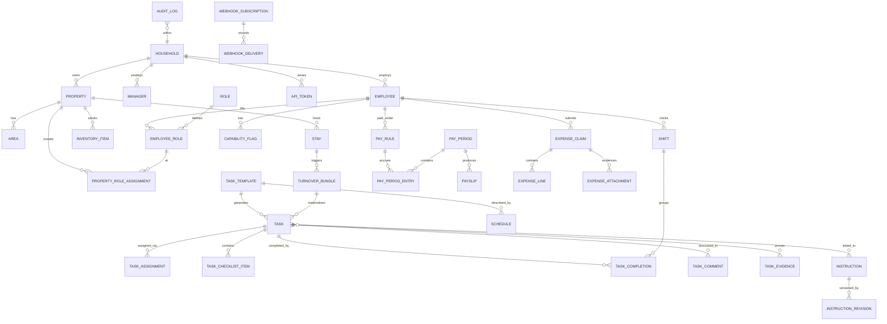

# 02 — Domain model

## Conventions

### Identifiers

- Every row uses a **ULID** primary key rendered as Crockford base32
  (26 chars, e.g. `01HXZ3...`). Stored as `CHAR(26)` in SQLite and
  `TEXT` / `uuid`-compatible in Postgres, never as an integer.
- ULIDs are **k-sortable** so we avoid adding a separate `created_at`
  index for time-range queries.
- Public URLs use ULIDs as-is; no separate slug table. Human-friendly
  references (e.g. `maid-maria`) are optional `handle` columns where
  useful, constrained unique per parent scope.

### Timestamps

- `created_at`, `updated_at` on every row. UTC.
- Business times (shift start/end, task due, stay check-in) that are
  logically local to a property carry a separate `timezone` column
  **on the parent property** — never on each row.
- `deleted_at` (nullable) implements **soft delete** on user-facing
  entities. Historical rows reference soft-deleted parents by ID;
  the UI hides them, the audit log never does.

### Soft delete policy

- All user-editable entities (Property, Employee, Role, Task,
  TaskTemplate, Instruction, InventoryItem, Stay) are **soft-deletable**.
- Children with a soft-deleted parent are **hidden** but their rows
  remain, so timesheets and audit log stay whole.
- Foreign keys between soft-deletable entities use
  `ON DELETE RESTRICT` at the DB level and a domain-level cascade that
  only ever soft-deletes. See skill `/new-fk-relationship`.
- `PUT /.../{id}/restore` (manager scope) reverses a soft delete.
- Hard delete is **admin-only** and available through a single dedicated
  CLI command (`miployees admin purge`) with a mandatory confirmation;
  it runs a trigger-based integrity check first.

### Naming

- Table names are **plural snake_case** (`tasks`, `task_templates`).
- Join tables `parents_children` (`employees_roles`).
- Enums are TEXT with a CHECK constraint in SQLite, native in Postgres.

### Tenancy seam

Every user-editable row carries `household_id CHAR(26) NOT NULL`. v1
ships with a single household row seeded at first boot; multi-tenancy
just means lifting the uniqueness scoping and adding RLS in Postgres
(§15). No code change elsewhere.

## Entity catalog

Diagram in Mermaid (viewers without Mermaid support can read the
prose list below).

### Core entities (by document)

- **Auth / identity** (§03): `manager`, `employee`, `passkey_credential`,
  `magic_link`, `api_token`, `session`.
- **Places** (§04): `property`, `area`, `stay`, `guest_link`,
  `ical_feed`.
- **People & roles** (§05): `role`, `employee_role`,
  `property_role_assignment`, `capability_flag`.
- **Work** (§06): `task_template`, `schedule`, `task`, `task_assignment`,
  `task_checklist_item`, `task_completion`, `task_evidence`,
  `task_comment`, `turnover_bundle`.
- **Instructions / SOPs** (§07): `instruction`, `instruction_revision`,
  `instruction_link`.
- **Inventory** (§08): `inventory_item`, `inventory_movement`.
- **Time / pay / expenses** (§09): `shift`, `pay_rule`, `pay_period`,
  `pay_period_entry`, `payslip`, `expense_claim`, `expense_line`,
  `expense_attachment`.
- **Comms** (§10): `digest_run`, `email_delivery`, `webhook_subscription`,
  `webhook_delivery`, `issue_report`.
- **LLM** (§11): `model_assignment`, `llm_call`, `agent_action`,
  `agent_approval`.
- **Cross-cutting** (§15): `audit_log`, `secret_envelope`.

Each subsequent document defines its entities' columns, invariants, and
state machines in detail. This file holds only the shared rules.

## Shared tables

### `households`

| column        | type        | notes                              |
|---------------|-------------|------------------------------------|
| id            | ULID PK     | seeded at first boot               |
| name          | text        | displayed in UI                    |
| created_at    | tstz        |                                    |
| settings_json | jsonb/text  | global instruction bank anchor, etc|

### `audit_log`

Append-only. Written in the same transaction as every mutation.

| column             | type    | notes                                 |
|--------------------|---------|---------------------------------------|
| id                 | ULID PK |                                       |
| household_id       | ULID FK |                                       |
| correlation_id     | ULID    | request-level; groups multi-row edits |
| occurred_at        | tstz    |                                       |
| actor_kind         | text    | `manager`, `employee`, `agent`, `system` |
| actor_id           | ULID    | nullable only for `system`            |
| via                | text    | `web`, `api`, `cli`, `worker`         |
| token_id           | ULID    | nullable; populated for `api`/`cli`   |
| action             | text    | `task.create`, `task.complete`, etc.  |
| entity_kind        | text    | `task`, `employee`, ...               |
| entity_id          | ULID    |                                       |
| before_json        | jsonb   | nullable (create)                     |
| after_json         | jsonb   | nullable (delete)                     |
| reason             | text    | optional, agent-supplied              |

Retention: default 2 years; configurable per household. Worker job
`rotate_audit_log` moves rows older than retention into
`audit_log_archive.jsonl.gz` under `$DATA_DIR/archive/`.

### `secret_envelope`

Per-household AES-GCM-encrypted blobs for secret values we must store
(OpenRouter API key, SMTP password, iCal feed URLs that carry tokens).
See §15.

## Schema evolution rules

- Every change ships as an **Alembic migration** in `migrations/`, with
  a short doc comment explaining intent.
- Additive migrations (new column nullable, new table, new enum value)
  deploy without downtime.
- Destructive migrations (drop column, narrow type) are a **two-release
  dance**: release N deprecates the column and stops reading it,
  release N+1 drops it.
- Every migration includes a downgrade unless it is lossy; lossy
  migrations say so explicitly and fail downgrade with a clear message.
- Backfills >1M rows run in the **worker**, not inline in the migration.
- See `/new-migration` skill for the complete checklist (column types,
  indexes, backfill, downgrade, idempotency).

## Portability (SQLite ↔ Postgres)

- Use only SQLAlchemy 2.x core expressions. No raw dialect SQL outside
  `app/adapters/db/`.
- JSON fields: SQLAlchemy `JSON` type maps to `jsonb` on Postgres and
  `TEXT` on SQLite. Queries against JSON fields live behind helper
  functions in `adapters/db/`.
- Full-text search:
    - SQLite: FTS5 virtual tables built from triggers.
    - Postgres: `GIN (tsvector)`.
    - Single query interface `search.search_tasks(q, scope)` picks the
      right backend.
- Transactions must hold for single logical operations and must not
  hold across LLM calls (see §11).

## Derived fields

Derived fields are computed and persisted **only** when recomputing on
read is too expensive:

- `task.scheduled_for_local` — stored alongside UTC for fast day-view
  queries.
- `shift.duration_seconds` — populated on clock-out.
- `expense_claim.total_amount_cents` — recomputed on line add/remove.
- `inventory_item.on_hand` — recomputed on every movement, in the same
  transaction.

A `--recompute` CLI command recomputes all derived fields; a periodic
CI job asserts no drift in test fixtures.

## Money

- All money stored as **integer cents** plus ISO-4217 `currency` (text)
  on the owning row. No floats.
- Per-household `default_currency`. Per-property override allowed.
- Multi-currency payroll is out of scope; expenses may be in any
  currency, converted to the household default at approval time using
  the snapshot rate stored on the expense line.

## Enums (canonical list)

Defined once per document where the enum lives; summarized here.

- `actor_kind`: `manager | employee | agent | system`
- `task_state`: `scheduled | in_progress | completed | skipped | cancelled | overdue`
- `stay_source`: `manual | airbnb | vrbo | booking | google_calendar | ical`
- `pay_rule_kind`: `hourly | monthly_salary | per_task | piecework`
- `expense_state`: `draft | submitted | approved | rejected | reimbursed`
- `delivery_state`: `queued | sent | delivered | bounced | failed`
- `capability`: see §05.
